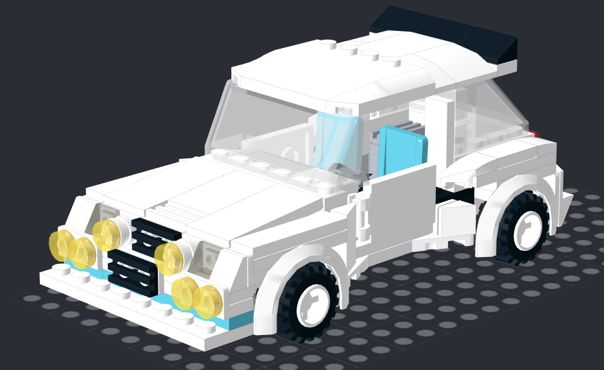

# Renault 5 Turbo 2

Two small (8x15) two-seater versions of the [Renault 5 Turbo 2](https://en.wikipedia.org/wiki/Renault_5_Turbo) from Group B. 

This car is difficult to capture, since the rear end is significantly wider than the front. There are two models here, a wider
front which matches the rest of the model better, and a narrower front, which is probably more true to the actual car but looks
a bit strange at this scale and level of detail. I might go back and try to make the narrow version 1 brick wider at the front,
7 instead of 6 wide.

